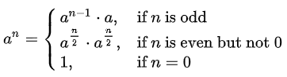

# 快速幂

**快速幂**（**Exponentiation by squaring**，平方求幂）是一种简单而有效的小算法，它可以以 $O(\log{n})$​​ 的时间复杂度计算乘方

> - 使用快速幂在相乘时不断取模，避免使用 `pow()` 溢出
> - 通过 `n = (n % MOD + MOD) % MOD` 保证最终结果是整数

## 递归快速幂

公式：



```c++
long MOD = 100000001;
long pow (long a, long n) {
    if (n == 0) return 1;
    else if (n & 1) return pow(a, n - 1) * a % MOD;
    else {
        long half = pow(a, n >> 1) % MOD;
        return half * half % MOD;
    }
}
```

## 非递归快速幂

例如，将 $7^{10}$​ 写成二进制的形式，即 $7^{(1010)_2} = 7^{(1000)_2} * 7^{(10)_2}$​​​

```c++
long MOD = 100000001;
long pow (long a, long n) {
    long res = 1;
    a %= MOD;
    while (n) {
        if (n & 1) res = (res * a) % MOD;
        a = (a * a) % MOD;
        n >>= 1;
    }
    return res % MOD;
}
```

## 参考资料

- [快速幂——知乎](https://zhuanlan.zhihu.com/p/95902286)

