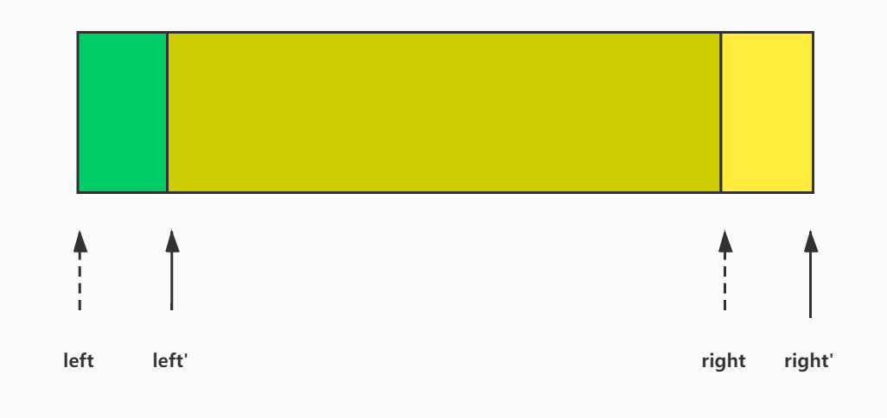

# 滑动窗口

**滑动窗口** 用来解决一些查找满足一定条件的连续区间的性质（长度等）的问题。由于区间连续，因此当区间发生变化时，可以通过旧有的计算结果对搜索空间进行剪枝，这样便减少了重复计算，降低了时间复杂度。往往类似于 “找出满足 xx 的最 x 的区间（子串、子数组）的 xx” 这类问题都可以使用该方法解决

> **注意**：使用滑动窗口解题的前提——左右边界不需要回退

## 模版

依此枚举左指针 `l` 作为所求区间的左端点，右指针 `r` 不断向后搜索满足条件的右边界，搜索结束后计算结果，再进入下一次循环，但此时无需恢复 `r`，因为 [`l`, `r`) 满足条件，[`l + 1`, `r`) 必然也满足条件，因此 `r` 复用上次的搜索结果，继续向后搜索即可，但是注意到下一次枚举是从 `l + 1` 作为所求区间的左端点，因此要恢复 `l`



```java
int l = 0, r = 0;
for (; l < n; l++) {
    // search
    while (xx) ++r;
    // calculate result 
    // restore the left pointer result, but don't restore the right's
}
```

## 例子

[LeeCode 3. 无重复字符的最长子串](https://leetcode-cn.com/problems/longest-substring-without-repeating-characters/)

给定一个字符串 `s` ，请你找出其中不含有重复字符的 **最长子串** 的长度。

示例 1:

```
输入: s = "abcabcbb"
输出: 3 
解释: 因为无重复字符的最长子串是 "abc"，所以其长度为 3。
```

示例 2:

```
输入: s = "bbbbb"
输出: 1
解释: 因为无重复字符的最长子串是 "b"，所以其长度为 1。
```

示例 3:

```
输入: s = "pwwkew"
输出: 3
解释: 因为无重复字符的最长子串是 "wke"，所以其长度为 3。
	请注意，你的答案必须是 子串 的长度，"pwke" 是一个子序列，不是子串。
```


示例 4:

```
输入: s = ""
输出: 0
```


提示：

- 0 <= s.length <= 5 * ${10^4}$
- `s` 由英文字母、数字、符号和空格组成

```java
public int lengthOfLongestSubstring(String s) {
    boolean[] a = new boolean[256];
    int n = s.length();
    int r = 0, res = 0;
    for (int l = 0; l < n; l++) {
        // 右指针向右搜索
        while (r < n && !a[(int) s.charAt(r)]) a[(int) s.charAt(r++)] = true;
        // 计算结果
        res = Math.max(res, r - l);
        // 恢复左指针位置的搜索标志
        a[(int) s.charAt(l)] = false;
    }
    return res;
}
```

## 经典题目

- [LeeCode 3. 无重复字符的最长子串](https://leetcode-cn.com/problems/longest-substring-without-repeating-characters/)
- [LeeCode 567. 字符串的排列](https://leetcode-cn.com/problems/permutation-in-string/)

